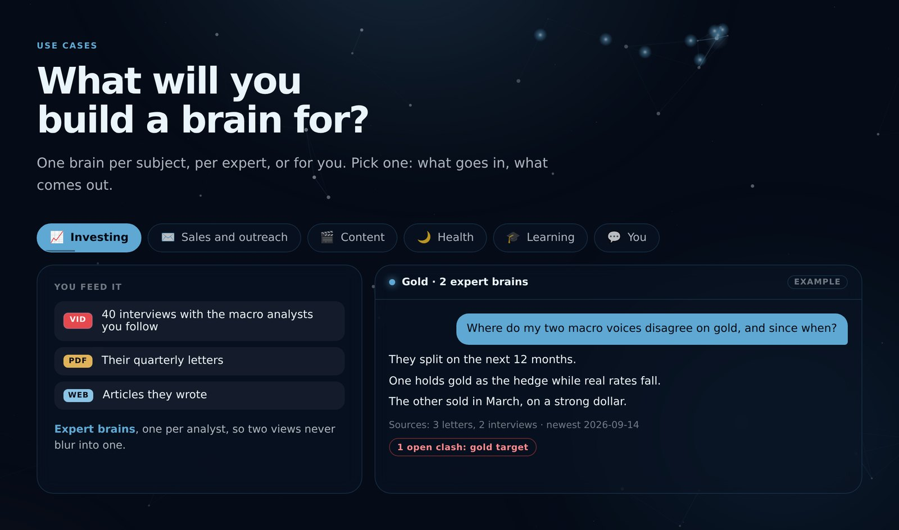
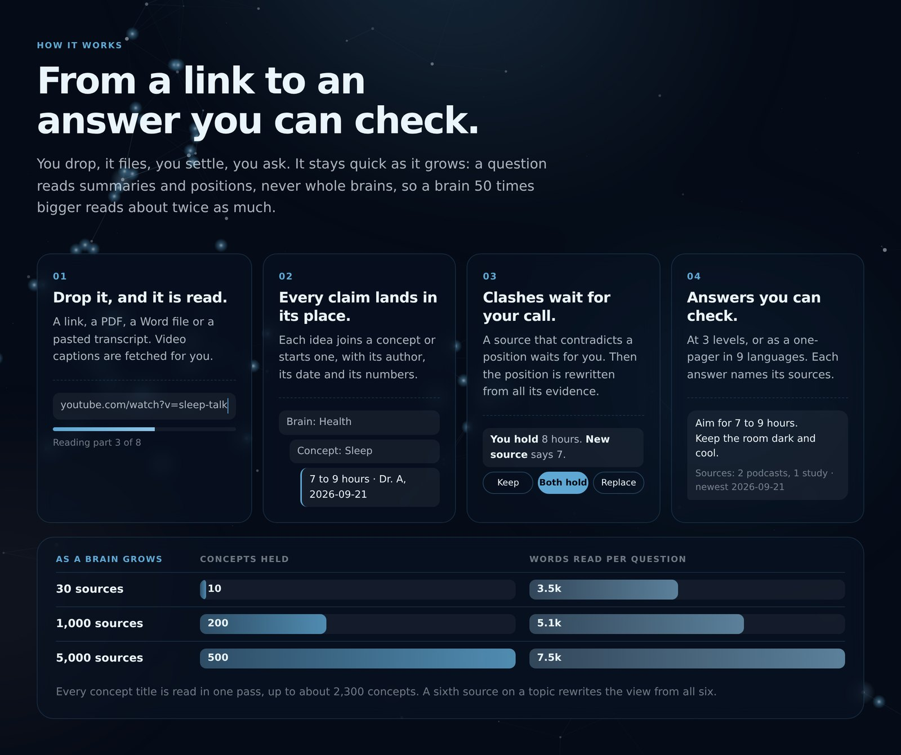

<div align="center">


# Brain

**The knowledge you choose, organized.**

Feed it the people and sources you trust. Ask anything, and see who said it.

[**Open the live demo**](https://brain.jeremylasne.com) &nbsp;·&nbsp; [How it works](#how-it-works) &nbsp;·&nbsp; [Run your own](#run-your-own)


<br><br>


</div>

<br>

## Why a brain

A classic AI chat answers from its training data. Karpathy's LLM wiki compiles your files into pages. A brain compiles them into **positions**, each backed by dated evidence you can open, and asks you when two sources clash.

| | Classic AI chat | Karpathy's LLM wiki | **Brain** |
|---|---|---|---|
| Answers from | Its training data | Your files, as pages | **Your sources, as positions with their evidence** |
| Proof | None, or a link it made up | A summary per page | **Author and date on every claim** |
| When sources disagree | Blended into one answer | Left side by side | **Flagged at each drop; you rule in a swipe** |
| New information | Frozen at the training date | Added when you run the agent | **Filed the day you drop it** |
| Whose view | An average of the internet | Your topics | **One brain per subject, per expert, or for you** |
| Setup | A chat box | Scripts, Obsidian, a coding agent | **A web page, on desktop and phone** |
| What you get | A reply | Pages, slides, charts | **Answers at 3 levels, one-pagers in 9 languages, a health score, a map** |

## What you get

<table>
<tr>
<td width="50%" valign="top">

<br><b>Answers with receipts.</b> Every line comes from a source you fed it, and the sources line names each author and date. Newer evidence wins on the same question.
</td>
<td width="50%" valign="top">

<br><b>It argues back.</b> A source that contradicts what you hold waits for your call. Swipe: A holds, B holds, or both. The position is rewritten from all its evidence.
</td>
</tr>
<tr>
<td width="50%" valign="top">

<br><b>It draws itself.</b> Every brain an arm, every concept a sucker, every line a link between brains. Each arm carries its health score out of 10.
</td>
<td width="50%" valign="top">

<br><b>One brain per subject, per expert, or for you.</b> Expert brains keep two analysts apart. A personal brain learns you as you talk to it.
</td>
</tr>
</table>

- **Three levels.** Normal answers with the numbers. Educational teaches from zero. Learning gives the steps and lets you reach the answer yourself.
- **One page, any shape.** A brain or a question becomes a summary, a quiz, a deep dive or use cases, in English, French, Spanish, German, Italian, Portuguese, Dutch, Japanese or Chinese.
- **Chats that stay.** Reopen, rename, pin up to 5. Old ones clear after 30 days.
- **Your look.** Each workspace takes a logo, an accent and a page colour, previewed as you pick them.
- **A memory for Claude.** The owner's workspaces connect to Claude through MCP: Claude reads and feeds the brains with its own model.

## How it works



1. **Drop.** A link, a PDF, a Word file or a pasted transcript. Video captions are fetched for you. Files are read in the browser, never uploaded.
2. **File.** Every topic is extracted once, with its numbers and quotes. Each idea joins a concept or starts one, with its author and date.
3. **Settle.** A claim that contradicts a position waits for you. Additions go straight in.
4. **Ask.** Answers, one-pagers and the map read the compiled positions, never the raw transcripts.

A position is re-derived from its whole evidence list at each drop, so a sixth source rewrites the view from all six. It stays quick as it grows, because a question reads summaries and positions, not whole brains:

| Brain | Read per drop | Read per question |
|---|---|---|
| 10 concepts, 30 sources | 1.0k words | 3.5k words |
| 200 concepts, 1,000 sources | 2.6k words | 5.1k words |
| 500 concepts, 5,000 sources | 5.0k words | 7.5k words |

## Use cases

| Who | What they feed it | What they ask |
|---|---|---|
| **Investors** | Letters and interviews from each analyst they follow, one expert brain each | *"Where do my two macro voices disagree on gold, and since when?"* |
| **Founders and sales** | Outreach and pricing talks, guides, case studies | *"Write my first cold email from what the outreach brain holds."* |
| **Creators** | Hook, format and scripting tutorials | *"Give me 5 hook formats with the numbers behind them."* |
| **Health** | Studies, podcasts and protocols on sleep, training and food | *"What dose and timing do my sources give for creatine?"* |
| **Students** | Course PDFs, articles, recorded lectures | *"Quiz me on depreciation, 8 questions, answers folded."* |
| **You** | Your own words, in a personal brain's chat | *"What did I decide on pricing last month, and why?"* |

## The personal brain <sup>alpha</sup>

A third kind of brain, next to subjects and experts. You talk to it; it keeps what you said.

- **It files your words.** A plan, a decision, an idea, a view. Each message becomes up to 3 notes, each claim dated and signed "You". Its own replies, and any guess about you, are never filed.
- **A change of mind** rewrites the note: the new view, and the one it replaces with its date.
- **Receipts.** One quiet line under each reply: "Filed: 1 new note, 1 note updated".
- **Add memory.** Paste or drop what another assistant knows about you, a ChatGPT memory or a notes file.
- **Private by design.** It can call your other brains; no other chat, one-pager, map, score, digest or connector reads it.

## Workspaces

A workspace holds its own brains and chats, and sees nothing of the others.

| | Octopus, Squidgy (the builder's) | The demo | Your own |
|---|---|---|---|
| Enter | Its own page, passphrase on top | One click, no passphrase | Made on the landing |
| Model calls paid by | The deployment's key | A separate demo key | **Your OpenRouter key** |
| Limits | None | 30 drops and 300 questions a month, shared | Your key's own |
| Create brains, personal brains | Yes | No | Yes |

**Your key stays yours.** It is checked once with OpenRouter, then kept in your browser. It travels with each call that needs a model and is never written to the database or logs. A workspace on its own key never falls back to the owner's.

## Run your own

A Convex deployment holds the data. Any static host serves `app/`.

```bash
git clone https://github.com/jlasne/brain && cd brain && npm install
npx convex dev
npx convex env set OPENROUTER_API_KEY sk-or-... --prod
npx convex deploy
npx convex run admin:setPass '{"space":"octopus","pass":"at least 8 characters"}' --prod
npx convex run admin:makeDemo '{"copy":["health","content","social"]}' --prod
```

Point `window.OCTOPUS_API` in the pages under `app/` at your deployment's `.convex.site` address. In Windows PowerShell, write each argument as `"{space:'octopus',pass:'...'}"`.

<details>
<summary><b>Settings</b></summary>

<br>

| Variable | What it does |
|---|---|
| `OPENROUTER_API_KEY` | Pays for model calls in the owner's workspaces. Required. |
| `DEMO_OPENROUTER_API_KEY` | A separate key for the demo, so its spend shows apart. Falls back to the one above. |
| `DEMO_MONTHLY_DROPS` | Drops the demo takes in 30 days, all visitors together. Default 30. |
| `DEMO_MONTHLY_ASKS` | Questions the demo answers in 30 days. Default 300. |
| `SUPADATA_API_KEY` | Fetches YouTube captions from a bare link. Without it, a video link asks for the transcript. |
| `SUPADATA_MODE` | `auto` transcribes videos that have no captions, at 2 credits a minute. |
| `RESEND_API_KEY`, `MAIL_FROM` | Mail one-pagers from the owner's workspaces. |
| `DIGEST_TO` | Where the Monday digest goes: the week's sources, new concepts and open conflicts. |

`admin:copyBrain '{"slug":"...","space":"demo"}'` adds one more brain to the demo. `digest:send '{"dry":true}'` previews the digest.

</details>

<details>
<summary><b>Claude</b></summary>

<br>

**Connector.** In an owner's workspace, Setup gives an MCP address. Paste it into Claude, ChatGPT or any MCP client: it reads and feeds that workspace's brains, and the client's own model does the thinking. `/doc` has the steps.

**Claude Code.** Copy `skill/brain/` into `~/.claude/skills/brain/`. The brains are then plain markdown files under `brains/`, following [the 41 rules](docs/PROTOCOL.md).

</details>

<details>
<summary><b>Security</b></summary>

<br>

- Passphrases are stored as salted SHA-256 hashes, one per workspace: 8 wrong guesses close that door for an hour.
- Every route checks the session before it reads a brain or calls a model.
- The demo runs on the default model within its monthly limits, and cannot create, rename or connect brains.
- A personal brain is read by its own chat only. Every other reader loads the workspace without it.
- A visitor's OpenRouter key is never stored on the server. Raw transcripts are never stored either: only what was extracted.

</details>

<details>
<summary><b>Project layout</b></summary>

<br>

```
app/            the landing, the app (one file) and the connector page
convex/         the server: routes, store, drop, one-pager, health, conflicts, personal
scripts/        678 checks, the app driven in a real browser included
docs/           the 41 rules (PROTOCOL.md), the server build (SERVER.md), the screenshots
skill/brain/    the same behaviour, as a Claude Code skill
templates/      the markdown shape of a brain
```

</details>

## Checks

```bash
npm run check
```

678 checks: the pages parse and bind, the Claude connector, the store and its workspaces, one-pagers, asking, linking, the health score, the personal brain, and the app itself driven in a real browser.

<br>

<div align="center">

Built in September 2026 by [Jeremy Lasne](https://www.jeremylasne.com) for The Build Games. MIT license.

</div>
