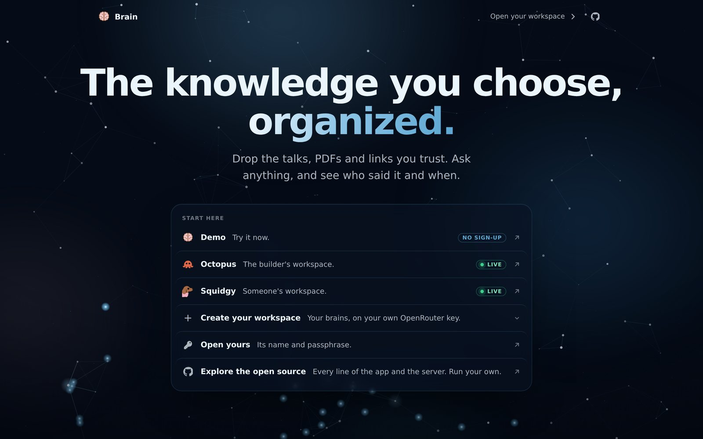
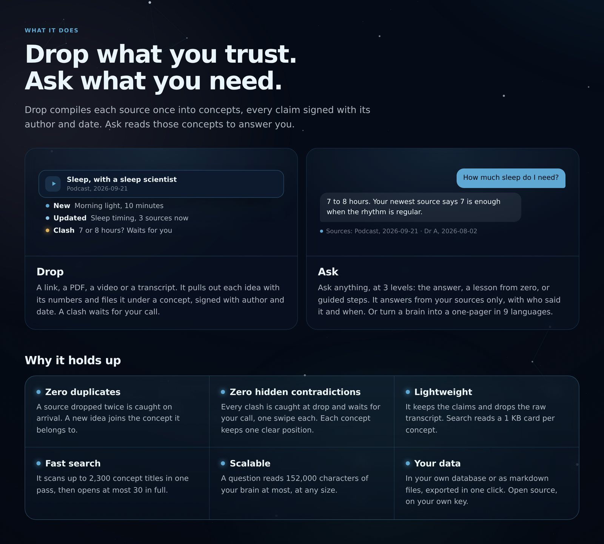
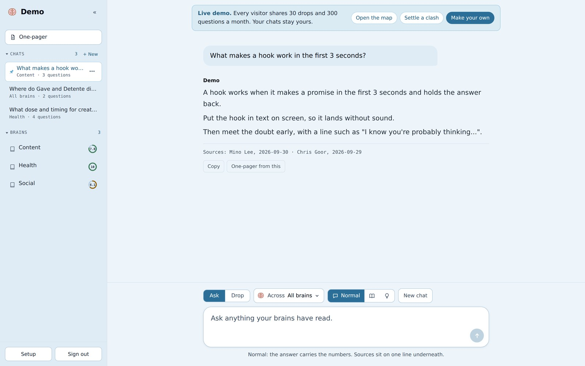
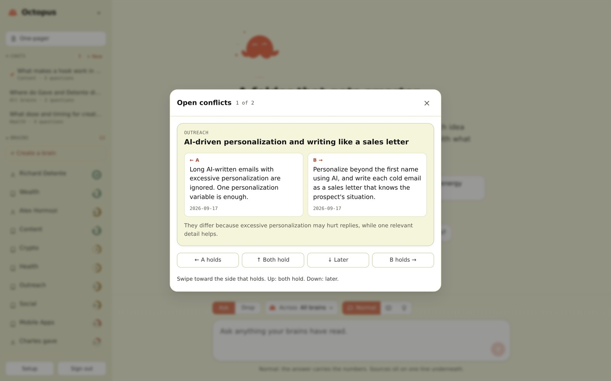
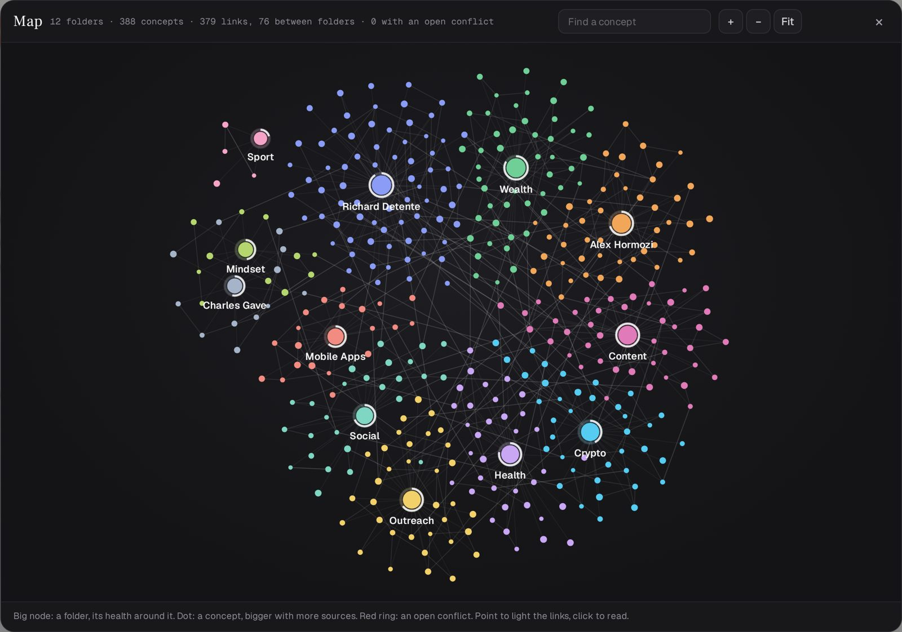
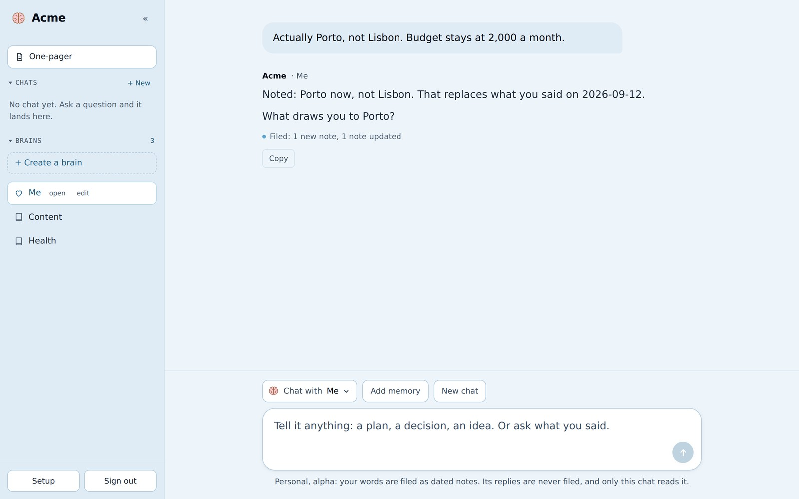

<div align="center">


# Tasu

**Files what you read, and answers from it.**

Drop a talk, a PDF or a link. Each idea lands in a folder with its author and date. Ask, and every answer cites them.

[**Open tasu.ai**](https://tasu.ai) &nbsp;·&nbsp; [Read the white paper](https://tasu.ai/about) &nbsp;·&nbsp; [Run your own](#run-your-own)


<br><br>



</div>

<br>

## What it does



**Drop.** A link, a PDF, a Word file, a video or a transcript. It pulls out each idea with its numbers and files it under a concept, signed with author and date. A claim that clashes with what you hold waits for your call.

**Ask.** Ask anything, at 3 levels: the answer, a lesson from zero, or guided steps. It answers from your sources only, and the last line names who said it and when.

Drop compiles each source once. Ask reads what was compiled. The [white paper](https://tasu.ai/about) walks through both, step by step.

## Why it holds up

- **Zero duplicates.** A source dropped twice is caught on arrival. A new idea joins the concept it belongs to.
- **Zero hidden contradictions.** Every clash is caught at drop and waits for your call, one swipe each. Each concept keeps one clear position.
- **Lightweight.** It keeps the claims and drops the raw transcript. Search reads a 1 KB card per concept.
- **Fast search.** It scans up to 2,300 concept titles in one pass, then opens at most 30 in full.
- **Scalable.** A question reads 152,000 characters of your brain at most, at any size.
- **Your data.** In your own database or as markdown files, exported in one click. Open source, on your own key.

## Compared

A classic AI chat answers from its training data. Karpathy's LLM wiki compiles your files into pages. A brain compiles them into **positions**, each backed by dated evidence you can open, and asks you when two sources clash.

| | Classic AI chat | Karpathy's LLM wiki | **Tasu** |
|---|---|---|---|
| Answers from | Its training data | Your files, as pages | **Your sources, as positions with their evidence** |
| Proof | None, or a link it made up | A summary per page | **Author and date on every claim** |
| When sources disagree | Blended into one answer | Left side by side | **Flagged at each drop; you rule in a swipe** |
| New information | Frozen at the training date | Added when you run the agent | **Filed the day you drop it** |
| Whose view | An average of the internet | Your topics | **One brain per subject, per expert, or for you** |
| Setup | A chat box | Scripts, Obsidian, a coding agent | **A web page, on desktop and phone** |
| What you get | A reply | Pages, slides, charts | **Answers at 3 levels, one-pagers in 9 languages, a health score, a map** |

## Inside the app

<table>
<tr>
<td width="50%" valign="top">

<br><b>Answers with receipts.</b> Every line comes from a source you fed it, and the sources line names each author and date. Newer evidence wins on the same question.
</td>
<td width="50%" valign="top">

<br><b>It argues back.</b> A source that contradicts what you hold waits for your call. Swipe: A holds, B holds, or both. The position is rewritten from all its evidence.
</td>
</tr>
<tr>
<td width="50%" valign="top">

<br><b>It draws itself.</b> One graph, the way Obsidian draws a vault: each folder a node ringed by its health, each concept a dot in its colour, each line a link. Point to light the neighbours, each link coloured by its kind, drag to rearrange, click to read.
</td>
<td width="50%" valign="top">

<br><b>It learns you.</b> A personal brain files what you tell it as dated notes, and says what it filed. Your other brains never read it.
</td>
</tr>
</table>

- **One field on the landing.** A passphrase opens the workspace it belongs to; any other, or none, opens the demo. The workspaces sit along the top, each opening on its own page.
- **A calm side panel.** Drop, One-pager and Settings sit on top. Chats and Folders follow, each a list that folds. Every folder is listed: yours first, then the ones another workspace lets you ask and drop into, then the ones you may only ask.
- **The chat bar floats** over the thread, with the folder picker, the level, the mic and send in one place.
- **Chat in several folders.** Click a folder to tick it, and tick as many as you like: the question reads those alone. The chat only asks.
- **A folder, open.** Open fills the main area: its scope, its counts, its health and the next move, then every concept, newest first, with the one open beside them. Chat in it, Drop into it, or edit its name and scope from there. The bar below asks that folder.
- **The model, picked in Settings.** It answers, reads drops and writes one-pagers: GLM 5.3 Flash by default, saved for the whole workspace.
- **Drop on its own screen.** Drop sits in the side panel and opens a screen with its own log. The chat waits as it was, one click away.
- **New folder.** A folder is fed by Drop, and one switch says it holds one person's view. A personal folder is fed by what you say.
- **Talk instead of typing.** Tap the mic and speak. The chip beside it says the language it listens in, EN by default; one tap moves to FR, then ES, DE, IT and PT, and the pick stays in your browser. It uses the free speech service in Safari on iPhone and Mac, Chrome and Edge. Elsewhere it points to the dictation your device already has.
- **Every drop grows the graph.** Each new idea finds its 6 nearest by meaning, in any language. Each link says how: needs, causes, supports, contradicts or example. Folders sort themselves into topics.
- **What follows.** Two linked ideas from different folders can add up to a third. Each drop writes up to 5, marked as Tasu's own conclusion, never a source, and answers can use them.
- **Learning path.** A folder's "needs" links set a reading order: the foundations first, then each step resting on the one before.
- **One page, any shape.** A brain or a question becomes a summary, a quiz, a deep dive or use cases, in 9 languages.
- **Chats that stay.** Reopen, rename, pin up to 5. Old ones clear after 30 days.
- **Greys, and your look.** Tasu wears greys and near-black. Octopus keeps its orange and Squidgy its brown. Each workspace can set a logo, an accent and a page colour, previewed as you pick them.
- **A memory for Claude.** The owner's workspaces connect to Claude through MCP: Claude reads and feeds the brains with its own model.

## The personal brain <sup>alpha</sup>

A third kind of brain, next to subjects and experts. You talk to it, and it keeps what you said.

- **It files your words.** Each message becomes up to 3 notes, each claim dated and signed "You". Only your words get filed.
- **A change of mind** rewrites the note: the new view, and the one it replaces with its date.
- **Add memory.** Paste what another assistant knows about you, or a notes file.
- **It talks to you as "you".** Its notes read "You want to move to Lisbon", and so do its replies.
- **It calls your other brains on its own.** When one holds something that bears on what you said, it brings it up and names it: "your Health brain says 3 to 5 g a day". A line under the reply shows which brains it called.
- **A file per person.** Each person you mention, by name or by role, gets a file: a short summary on top, then what is still open, their facts by section (identity, contact details, you and them, work, tastes), their people both ways, and their whole history, year by year, each moment dated and told with its details. It only grows: a changed fact keeps the old one with the day it ended, and your own words stay folded underneath. The People tab lists them, the most recent first, and one click finds the people in your older notes. Edit a card by hand, or merge two cards of the same person: the mentions and names join, and the card is written again as one.
- **It interviews you.** Tap Interview me: one quick question at a time, from 335 in 17 chapters, life story first. Each takes under 30 seconds: a fact, a choice, a number or one sentence. A one-word answer gets one follow-up, a question your notes already answer is skipped, and every 10 answers it reads back 3 notes for you to confirm or correct. Say skip to pass; Stop pauses it, and it picks up where you left off.
- **It asks in passing.** Every few messages, when you asked nothing, it may end its reply with one question from the chapters it knows least.
- **Your twin, measured.** 30 test questions, answered once and never filed. Your twin answers them from your notes, you score each 0 to 2, and a retest 2 weeks later sets your own ceiling. The twin profile writes your notes as 7 parts: identity, values, beliefs, decision rules, voice, knowledge and boundaries.
- **Private.** Its own chat is its only reader.

## Workspaces

A workspace holds its own brains and chats, and sees nothing of the others.

| | Octopus, Squidgy | The demo | Your own |
|---|---|---|---|
| Whose | The builder's, and someone's | Anyone's | Yours |
| Enter | Its own page, passphrase on top | One click | Made on the landing |
| Model calls paid by | The deployment's key | A separate demo key | **Your OpenRouter key** |
| Limits | None | 30 drops and 300 questions a month, shared | Your key's own |
| Create brains, personal brains | Yes | No | Yes |

**A workspace for someone, on your key.** `npx convex run admin:makeWorkspace "{name:'PandAAAHH',pass:'ABC12345'}" --prod` makes an empty workspace behind that passphrase, which its owner changes from Setup. It runs on the deployment's key, like Octopus and Squidgy, and opens from the landing by its name. You can share a brain with it.

**Share a brain.** In the owner's Settings, a fold called Share brain has a workspace select and a button per brain. It is one brain, not a copy. Shared with Squidgy, a drop in either workspace fills both, and a clash ruled in one is ruled in both. Shared with the demo, visitors can ask it and nobody can change it. Each workspace keeps its own passphrase, chats and other brains. A personal brain is never shared, and a workspace can leave a brain it was given.

**Change the passphrase.** Settings asks for the current one, sets the new one, and signs everyone else out.

**Your key stays yours.** It is checked once with OpenRouter, then kept in your browser, and travels only with the calls that need a model. The server keeps no copy. A workspace on its own key runs on that key only. Sign out forgets it.

## Run your own

A Convex deployment holds the data. Any static host serves `app/`.

```bash
git clone https://github.com/jlasne/brain && cd brain && npm install
npx convex dev
npx convex env set OPENROUTER_API_KEY sk-or-... --prod
npx convex deploy
npx convex run admin:setPass '{"space":"octopus","pass":"at least 8 characters"}' --prod
npx convex run admin:makeDemo '{"copy":["health","content","social"]}' --prod
```

Point `window.OCTOPUS_API` in the pages under `app/` at your deployment's `.convex.site` address. In Windows PowerShell, write each argument as `"{space:'octopus',pass:'...'}"`.

<details>
<summary><b>Settings</b></summary>

<br>

| Variable | What it does |
|---|---|
| `OPENROUTER_API_KEY` | Pays for model calls in the owner's workspaces. Required. |
| `DEMO_OPENROUTER_API_KEY` | A separate key for the demo, so its spend shows apart. Falls back to the one above. |
| `DEMO_MONTHLY_DROPS` | Drops the demo takes in 30 days, all visitors together. Default 30. |
| `DEMO_MONTHLY_ASKS` | Questions the demo answers in 30 days. Default 300. |
| `DEMO_MONTHLY_STEPS` | Reads, plans and stores the demo makes in 30 days. Default 20 a drop. |
| `SUPADATA_API_KEY` | Fetches YouTube captions from a bare link. Without it, a video link asks for the transcript. |
| `SUPADATA_MODE` | `auto` transcribes videos that have no captions, at 2 credits a minute. |
| `OTHERS_FETCH_DAY` | Pages and transcripts fetched for every other workspace together, a day. Default 100, on top of 20 each. |
| `RESEND_API_KEY`, `MAIL_FROM` | Mail one-pagers from the owner's workspaces. |
| `DIGEST_TO` | Where the Monday digest goes: the week's sources, new concepts and open conflicts. |

`admin:copyBrain '{"slug":"...","space":"demo"}'` adds one more brain to the demo. `digest:send '{"dry":true}'` previews the digest.

</details>

<details>
<summary><b>Claude</b></summary>

<br>

**Connector.** In an owner's workspace, Settings gives an MCP address. Paste it into Claude, ChatGPT or any MCP client: it reads and feeds that workspace's brains, and the client's own model does the thinking. `/doc` has the steps.

**Claude Code.** Copy `skill/brain/` into `~/.claude/skills/brain/`. The brains are then plain markdown files under `brains/`, following [the 41 rules](docs/PROTOCOL.md).

</details>

<details>
<summary><b>Security</b></summary>

<br>

- Passphrases are stored as salted SHA-256 hashes, one per workspace: 8 wrong guesses close that door for an hour. Each guess is counted before it is checked, so guesses sent all at once get no more.
- Every route checks the session before it reads a brain or calls a model.
- The demo runs on the default model within its monthly limits, and cannot create, rename or connect brains.
- A personal brain is read by its own chat only. Every other reader loads the workspace without it.
- A visitor's OpenRouter key is never stored on the server. It travels only with the calls that spend a model, and Sign out forgets it. Raw transcripts are never stored either: only what was extracted.
- Linking runs later on the deployment's key, so the demo and a workspace on its own key never start it.
- The Word reader loads from cdnjs only if its bytes match the published hash.

</details>

<details>
<summary><b>Project layout</b></summary>

<br>

```
app/            the landing, the app (one file), the white paper and the connector page
convex/         the server: routes, store, drop, one-pager, health, conflicts, personal
scripts/        919 checks, the app driven in a real browser included
docs/           the 41 rules (PROTOCOL.md), the server build (SERVER.md), the screenshots
skill/brain/    the same behaviour, as a Claude Code skill
templates/      the markdown shape of a brain
```

</details>

## Checks

```bash
npm run check
```

919 checks: the pages parse and bind, the Claude connector, the store and its workspaces, one-pagers, asking, linking, the health score, the personal brain, and the app itself driven in a real browser.

<br>

<div align="center">

Built in September 2026 by [Jeremy Lasne](https://www.jeremylasne.com) for The Build Games. MIT license.

</div>
